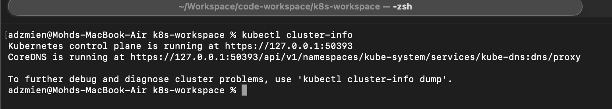
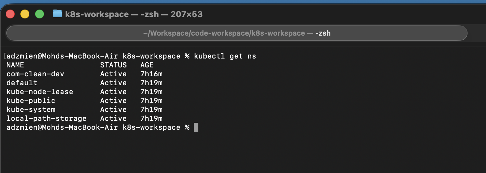
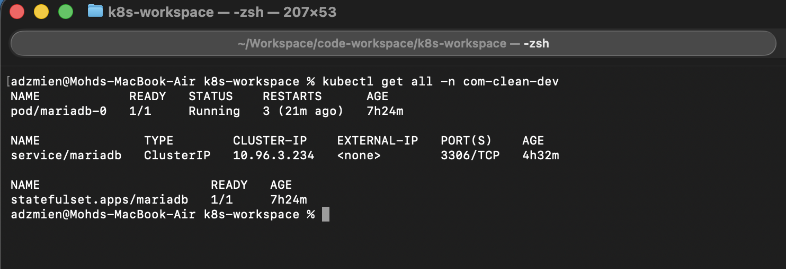
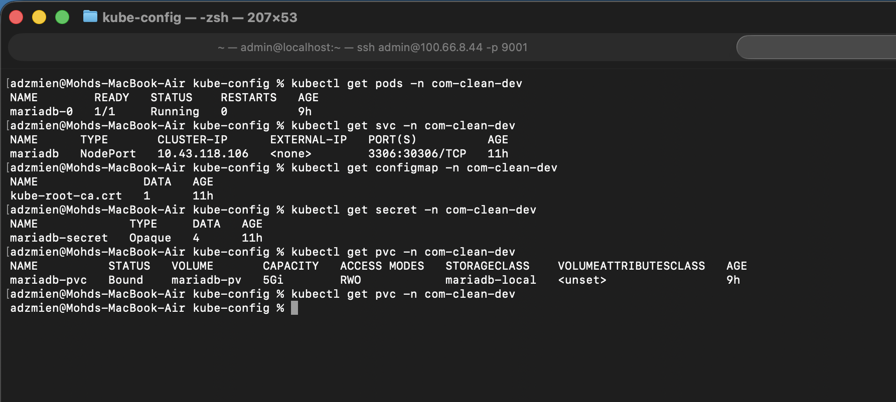

# ⚙️ Kubernetes Quickstart for Developers

A clean and practical collection of essential `kubectl` commands for day-to-day development.  
This guide is optimized for local Kubernetes clusters such as **Kind** and **Minikube**, and includes real-world examples, shortcuts, and reliable patterns for debugging workloads, connecting to databases, and managing Kubernetes resources efficiently.

---

## 🧭 Common CLI

<details>
  <summary>Click to expand</summary>

### 🔎 Get cluster info

```bash
kubectl cluster-info
```



---

### 🗂 List all namespaces

```bash
kubectl get ns
```



---

### 📋 List all resources in the namespace

```bash
kubectl get all -n com-clean-dev
```



---

### 📋 List by type in the namespace

```bash
kubectl get pods -n com-clean-dev
```



</details>

---

</details>